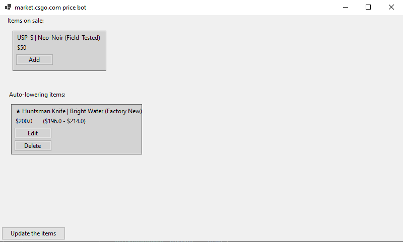

# [market.csgo.com](https://market.csgo.com/en/) Auto-Lowering Price Software

## How Does This Work?
This software automatically lowers your item's price by **$0.001** below the lowest price listed by another user. This ensures that your item is always prioritized when someone uses the **"Fast Buy"** function on [market.csgo.com](https://market.csgo.com/en/).

---

## Build
The latest compiled executable can be found [here](https://github.com/liljaba1337/market-csgo-pricebot/actions/workflows/dotnet.yml)

## Troubleshooting

### My prices are not being updated
Prices are refreshed only once every **60 seconds** because the market does not allow price changes more frequently than that.

### My currency is displayed incorrectly
If your currency on **[market.csgo.com](https://market.csgo.com/en/)** is set to anything other than **USD**, prices will be displayed in your selected currency, even if a dollar sign appears next to them.  
This does **not** affect how the software functions—just set your **min** and **max** prices in your chosen currency.

However, if you want prices to display correctly, change your currency on **[market.csgo.com](https://market.csgo.com/en/)** to **USD**.

---

## Need More Help?
If you encounter any other issues, please open an **issue** on the project's repository.

Advanced users can launch the software with the console visible by using the `-c` flag.
